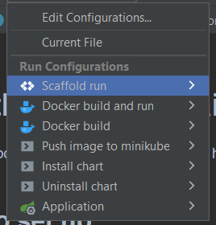

<h1> Health-check-domain-service </h1>

Service responsible for whole domain logic of health-check.

<h2>How to set up: </h2>

1. Setup mandatory
   infrastructure [check health-check-infrastructure project](https://github.com/kudybson/health-check-infrastructure)
2. Use scripts located in .run (if you're using IntellijIDEA u can find ready to start execution), should look like this:

   
   
Above scripts are responsible for:
* Application - runs application with local profile 
* Docker build - builds docker image (with mvn clean install before)
* Docker build and run - build docker image and runs it on local docker with redirected ports
* Push image to minikube - pushes image from local container registry to minicube cluster registry (use first Docker build)
* Install chart - install chart of service in minikube (push image first)
* Uninstall chart - removes previously installed chart